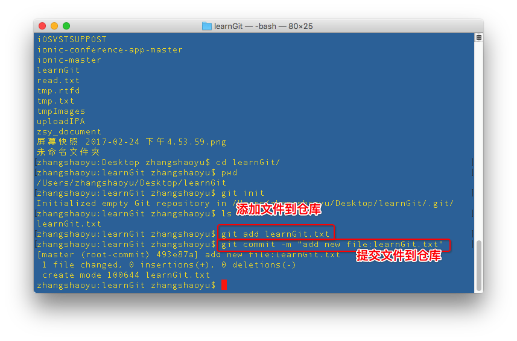
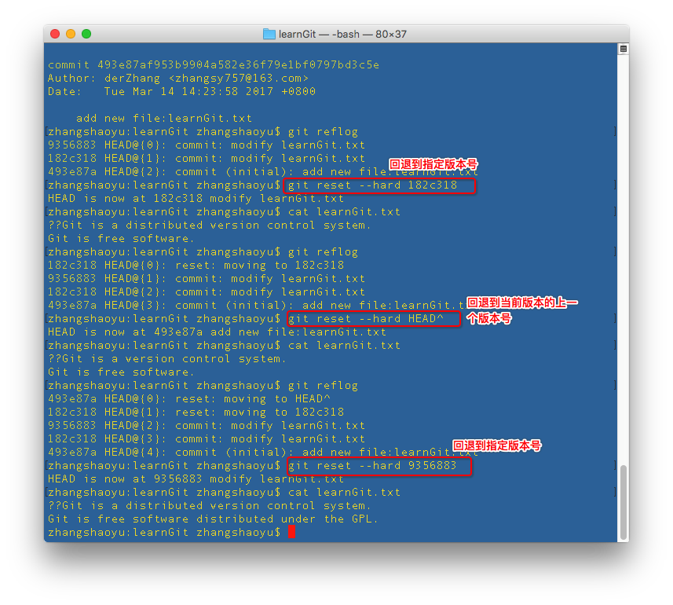

# Git_Initialization初始化使用

Git的配置
* 1 指定用户名：git config --global user.name "Your Name"
* 2 指定邮件地址：git config --global user.email "email@example.com"
~~~ javascript
// 指定用户名
git config --global user.name "devZhang"
// 指定邮件地址
git config --global user.email "tmp@163.com"
~~~
`如何取消设置？`

Git的使用
仓库，也叫版本库repository，即文件管理（修改、删除）的目录。
* 1 创建目录
  * 1-1 创建存放文件的目录：mkdir 目录名。
  * 1-2 进入目录：cd 目录名。
  * 1-3 查看目录路径：pwd。
~~~ javascript
// 创建文件目录
mkdir learnGit
// 进入文件目录
cd learnGit
// 查看目录路径
pwd
~~~ 
* 2 将目录变成Git可以管理的仓库
  * git init
    * 创建成功后，目录下会多一个Git用来跟踪管理版本库的 .git 的目录。
    * 注意：空目录，或已经有资料的目录都可以创建Git仓库。
~~~ javascript
git init
~~~ 
* 3 把文件添加到版本库
  * 注意：Git版本库只能管理以纯文本（txt文件、网页、程序代码等）编写的文件，而图片文件，或音视频文件则只知道如从100KB变成120KB的改变，而不像知道文本文件第几行新增，或修改，或删除了某个单词这么详细。
  * 3-1 把文件添加到仓库：git add 文件名。
  * 3-2 把文件提交到仓库：git commit -m 备注。
~~~ javascript
// 添加单个修改文件
git add learnGit.txt
// 添加所有修改
git add .
// 提交修改文件（添加备注说明）
git commit -m “添加文件learnGit.txt”
~~~ 
* 4 查看仓库状态
  * 4-1 仓库当前的状态：git status。
  * 4-2 仓库文件修改内容：git diff，或git diff 文件名。
~~~ javascript
// 查看仓库当前状态
git status
// 查看仓库修改内容
git diff
// 或
git diff learnGit.txt
~~~ 
* 5 查看仓库记录
  * 显示从最近到最远的提交日志。
  * 历史记录：git log；或单行历史记录：git log --pretty=oneline。
~~~ javascript
git log
// 单行历史记录
git log --pretty==oneline
~~~ 
* 6 查看命令历史
  * 显示每一次命令的记录。
  * 命令历史：git reflow。
~~~ javascript
git reflow
~~~ 
* 7 版本回退
  * 版本回退，上个版本head^，上上个版本head^^，……，100个版本head~100。
  * 回退版本：git reset --hard HEAD版本，或git reset --hard 版本号。如：
~~~ javascript
// 上个版本 
git reset --hard HEAD^
// 上上个版本
git reset --hard HEAD^^
// 或指定版本号
git reset --hard 655645645
~~~ 
* 8 修改撤销
  * 情况1 文件修改后但没有add到暂存区时，即在工作区中修改的可以撤销；
  * 情况2 文件add到暂存区后做了修改时，即在暂存区中修改的可以撤销；
  * 撤销修改内容：git checkout —- 文件名称。如：
~~~ javascript
git checkout -- learnGit.txt
~~~ 
* 9 暂存区的修改回退到工作区
  * git reset HEAD 文件名称。如：
~~~ javascript
git reset HEAD learnGit.txt
~~~ 
* 10 删除文件
  * 先将文件从目录文件夹中删除，再从版本库中删除
  * 10-1 删除文件：git rm 文件名称。
  * 10-2 提交删除文件：git commit -m 备注。
~~~ javascript
// 删除文件
git rm test.txt
// 提交文件（添加备注说明）
git commit -m “remove file:test.txt”
~~~ 

# 效果图

