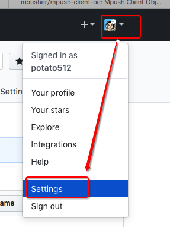
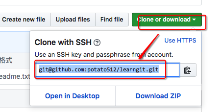

# Git_RemoteRepo远程仓库

本地Git仓库和GitHub仓库之间的传输是通过SSH加密的
1 创建SSH Key。
  * 查看ssh目录命令：which ssh。在用户主目录下，看看有没有.ssh目录，如果有，再看看这个目录下有没有密钥id_rsa（保密）和公钥id_rsa.pub（公开）这两个文件，如果已经有了，可直接跳到下一步。
  * 使用命令创建SSH Key：ssh-keygen -t rsa -C "youremail@example.com”。
~~~ javascript
// 查看ssh目录
which ssh

// 创建ssh key
ssh-keygen -t rsa -C "tmp@163.com”
~~~

2 设置公钥信息
登录网站并登录：https://github.com
设置公钥：用户信息-Account setting-SSH Keys-Add SSH Keys-Title（填写标题）/Key（粘贴公钥）。
作用：GitHub需要识别出你推送的提交确实是你推送的。
注意：多台电脑时，添加多个SSH Keys。
~~~ javascript
// 设置公钥路径
打开github网络-登录-用户信息-Account setting-SSH Keys-Add SSH Keys-Title（填写标题），Key（填写公钥）。
~~~

3 添加公钥信息
添加公钥命令：ssh-add 路径/公钥文件名。
查看ssh有效性命令：ssh -T git@github.com。
~~~ javascript
// 添加本地仓库公钥
ssh-add learnGitRSA

// 查看ssh有效性
ssh -T git@github.com
~~~

本地仓库与远程仓库的关联
1 本地仓库与远程仓库关联
关联命令：git remote add origin git@github.com:帐户名/远程仓库名.git。
~~~ javascript
git remote add origin git@github.com:potato512/learngit.git
~~~

2 远程仓库拉取最新代码到本地仓库
拉取命令：

3 本地仓库代码提交到远程仓库
提交命令（首次）：git push -u origin master。
提交命令（二次）：git push origin master。
说明：-u表示第一次提交；origin表示远程仓库；master表示当前分支。
~~~ javascript
// 提交命令（首次）
git push -u origin master
// 提交命令（二次）
git push origin master
~~~

4 克隆远程仓库到本地
克隆命令：git clone git@github.com:帐户名/远程仓库名.git。
注意：克隆时，支持ssh协议，及https协议。ssh速度最快，而https每次都需要输入口令，且速度慢。
~~~ javascript
git clone git@github.com:potato512/learngit.git
~~~

# 效果图

